````markdown
# 🍔 FoodGo — Smart Delivery Platform

A **Full-Stack Food Delivery Web Application** developed using **React.js**, **Node.js**, **Express.js**, and **MongoDB**. FoodGo provides customers with a seamless online food ordering experience while enabling administrators, restaurant owners, and delivery partners to manage restaurants, menus, orders, and deliveries through dedicated dashboards.

---

# 📖 About the Project

FoodGo is a modern food delivery platform designed to simplify the process of discovering restaurants, ordering food, and tracking deliveries online.

Customers can browse approved restaurants based on location, explore menus, add dishes to their cart, place orders, manage favourites, and track their orders.

The application also provides dedicated dashboards for **Administrators, Restaurant Owners, and Delivery Partners**, allowing each role to manage their respective activities efficiently.

This project demonstrates practical implementation of full-stack web development concepts, including frontend development, REST API integration, database management, authentication, role-based authorization, real-time communication, location-based services, and responsive UI design.

---

# ✨ Features

## 👤 Customer Module

- Secure User Registration and Login
- Browse Approved Restaurants
- City-Based Restaurant Discovery
- View Restaurant Details
- Browse Restaurant Menus
- Add Dishes to Cart
- Update Cart Quantity
- Remove Cart Items
- Checkout Process
- Place Food Orders
- Order Confirmation
- Order History
- Order Tracking
- Favourite Restaurants
- Favourite Dishes
- Customer Dashboard
- Responsive User Interface

---

## 🏪 Restaurant Owner Module

- Secure Restaurant Owner Login
- Dedicated Restaurant Dashboard
- Restaurant Information Management
- View Restaurant Data
- Menu Management
- Add New Dishes
- Edit Dishes
- Delete Dishes
- View Restaurant Orders
- Manage Order Status
- Restaurant-Specific Menu Management

---

## 🔐 Admin Module

- Secure Admin Login
- Admin Dashboard
- Restaurant Management
- Restaurant Approval
- User Management
- Restaurant Owner Management
- Delivery Partner Management
- Menu Management
- Order Monitoring
- Platform Management

Only **admin-approved restaurants** are displayed to customers.

---

## 🚴 Delivery Partner Module

- Secure Delivery Partner Login
- Dedicated Delivery Dashboard
- View Assigned Orders
- Manage Assigned Deliveries
- Update Delivery Status
- Monitor Delivery Workflow

---

# ⚡ Real-Time Features

FoodGo uses **Socket.IO** to support real-time communication.

- Real-Time Order Updates
- Delivery Status Updates
- Order Workflow Communication
- Dashboard Updates

---

# 📍 Location-Based Features

FoodGo supports location-based restaurant discovery using:

- Leaflet
- React Leaflet
- Latitude and Longitude
- Restaurant Map Locations
- City-Based Filtering

Example locations include:

- Chennai
- Bengaluru
- Hyderabad
- Coimbatore
- Kochi
- Madurai

---

# 🛠️ Tech Stack

## Frontend

- React.js
- JavaScript (ES6+)
- HTML5
- CSS3
- Bootstrap
- React Router
- Axios
- React Icons
- Leaflet
- React Leaflet

## Backend

- Node.js
- Express.js
- REST APIs
- Socket.IO

## Database

- MongoDB
- MongoDB Atlas

## Authentication & Security

- JWT
- bcrypt
- Helmet
- CORS

## Tools

- Git
- GitHub
- Visual Studio Code

## Deployment

- Vercel
- MongoDB Atlas

---

# 🔐 Authentication & Authorization

FoodGo implements secure authentication using **JSON Web Tokens (JWT)**.

The application supports:

- Access Tokens
- Refresh Tokens
- Password Hashing
- Protected Routes
- Role-Based Authorization
- Secure API Access

### User Roles

```text
Customer
    │
    ├── Restaurants
    ├── Menu
    ├── Cart
    ├── Checkout
    ├── Orders
    └── Favourites

Restaurant Owner
    │
    ├── Restaurant
    ├── Menu
    └── Orders

Admin
    │
    ├── Users
    ├── Restaurants
    ├── Menus
    ├── Orders
    └── Delivery Partners

Delivery Partner
    │
    ├── Assigned Orders
    └── Delivery Status
````

---

# 🔄 Order Flow

```text
Customer
   ↓
Browse Restaurants
   ↓
Select Restaurant
   ↓
Browse Menu
   ↓
Add Food to Cart
   ↓
Checkout
   ↓
Place Order
   ↓
Restaurant Receives Order
   ↓
Restaurant Processes Order
   ↓
Delivery Partner Handles Delivery
   ↓
Order Delivered
```

---

# 📂 Project Structure

```text
FoodGo
│
├── backend
│   │
│   ├── src
│   │   ├── config
│   │   ├── controllers
│   │   ├── middleware
│   │   ├── models
│   │   ├── routes
│   │   ├── services
│   │   ├── sockets
│   │   ├── utils
│   │   ├── app.js
│   │   └── server.js
│   │
│   ├── scripts
│   ├── package.json
│   └── .env
│
├── frontend
│   │
│   ├── public
│   │
│   ├── src
│   │   ├── components
│   │   ├── pages
│   │   ├── services
│   │   ├── context
│   │   ├── assets
│   │   ├── styles
│   │   ├── App.jsx
│   │   └── main.jsx
│   │
│   ├── package.json
│   └── .env
│
├── package.json
├── run-foodgo.mjs
├── .gitignore
├── README.md
└── LICENSE
```

---

# 🚀 Getting Started

## Clone the Repository

```bash
git clone https://github.com/Selvadivya-S/FoodGo.git
```

Move into the project directory:

```bash
cd FoodGo
```

---

# ⚙️ Backend Setup

Navigate to the backend folder:

```bash
cd backend
```

Install the required dependencies:

```bash
npm install
```

Create a `.env` file:

```env
PORT=5000
CLIENT_URL=http://localhost:5173

MONGO_URI=your_mongodb_connection_string

JWT_ACCESS_SECRET=your_access_secret
JWT_REFRESH_SECRET=your_refresh_secret
```

Start the backend:

```bash
npm run dev
```

Backend will run at:

```text
http://localhost:5000
```

---

# 💻 Frontend Setup

Open a new terminal.

Navigate to the frontend folder:

```bash
cd frontend
```

Install the required packages:

```bash
npm install
```

Create a `.env` file:

```env
VITE_API_URL=http://localhost:5000/api
```

Run the React application:

```bash
npm run dev
```

The application will be available at:

```text
http://localhost:5173
```

---

# 🌐 Live Application

## Frontend

[https://foodgoo-fullstack-website.vercel.app/](https://foodgoo-fullstack-website.vercel.app/)

## Backend

[https://food-go-full-stack-website-mdc8.vercel.app/api](https://food-go-full-stack-website-mdc8.vercel.app/api)

## GitHub Repository

[https://github.com/Selvadivya-S/FoodGo-FullStack--Website](https://github.com/Selvadivya-S/FoodGo-FullStack--Website)

---

## 📸 Application Screenshots

## 🏠 Home Page



---

## 🔐 Login Page

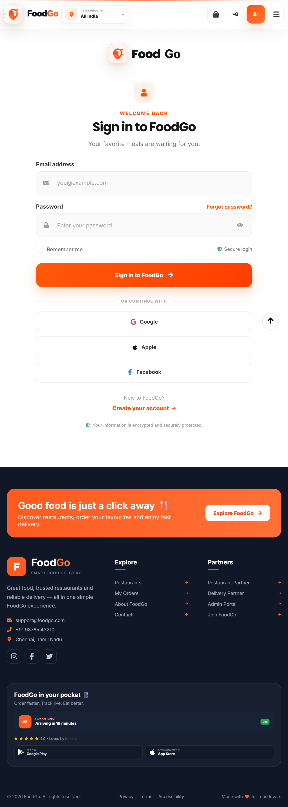

---

## 📝 Registration Page

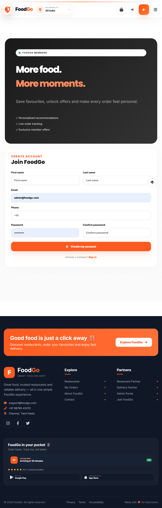

---

## 🏪 Restaurants Page

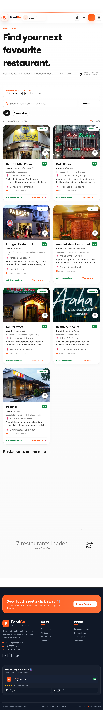

---

## 🍽️ Restaurant Details

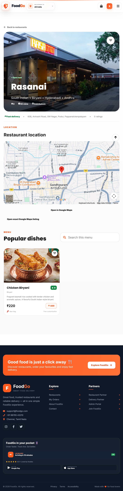

---

## 🛒 Shopping Cart

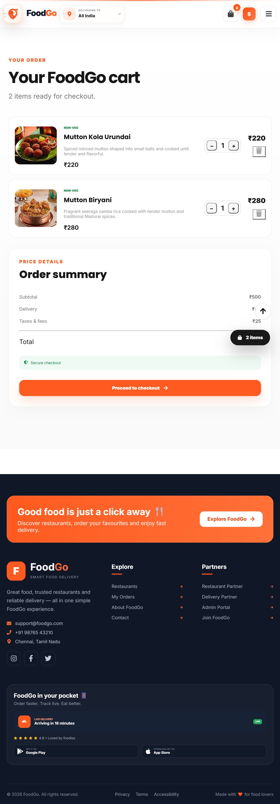

---

## 💳 Checkout

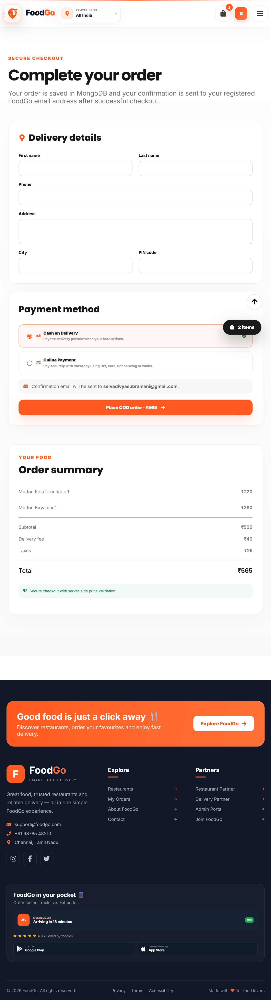

---

## 📦 Order Confirmation

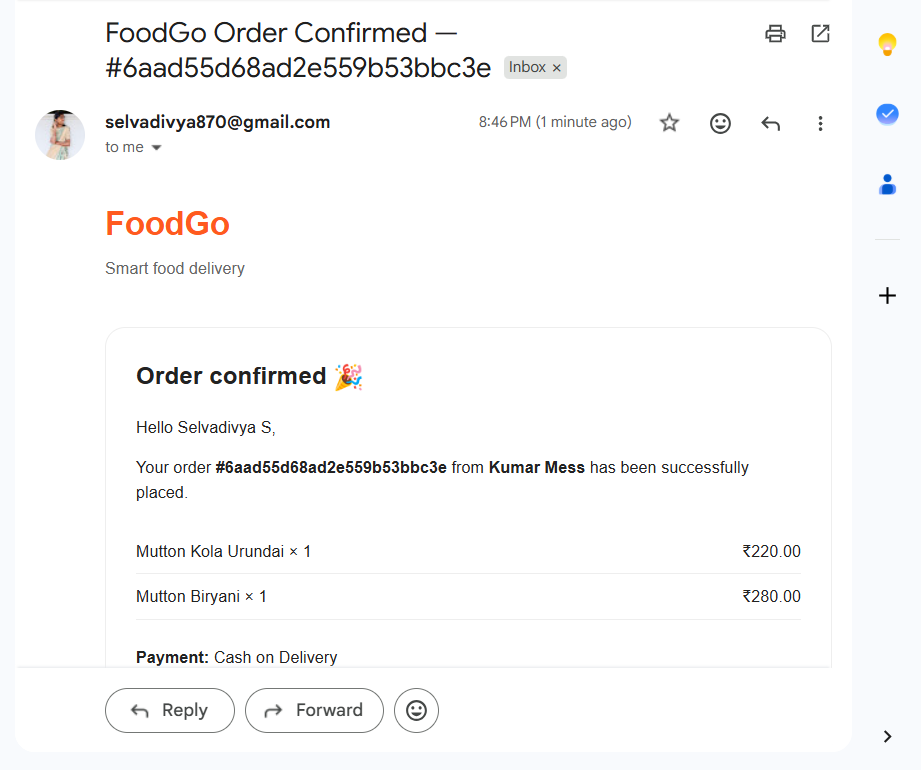

---

## 📋 Customer Orders

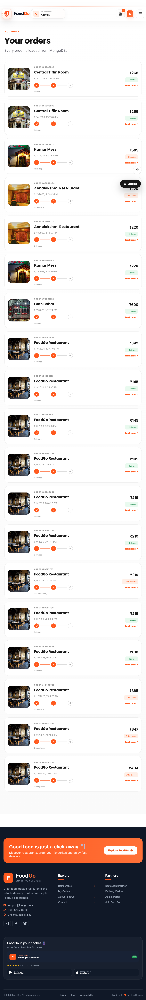

---

## 📍 Track Order

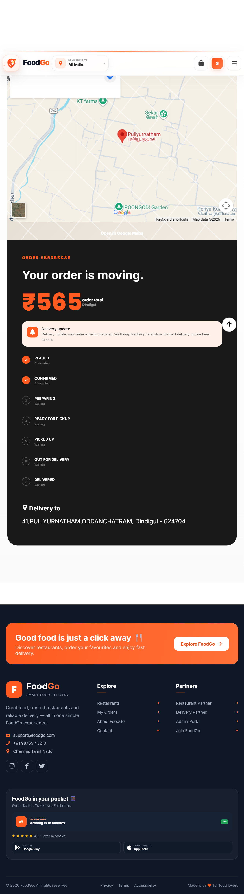

---

## 👤 Customer Dashboard

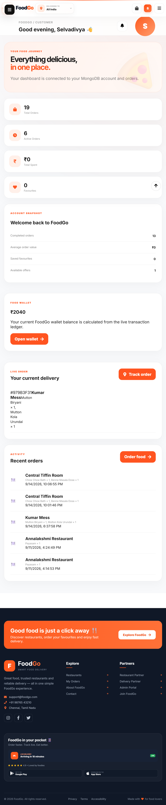

---

## 🔐 Admin Dashboard

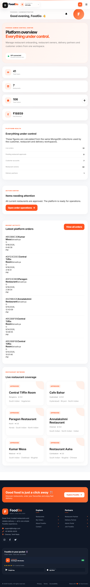

---

## 🏪 Restaurant Dashboard

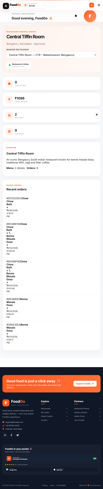

---

## 🚴 Delivery Dashboard

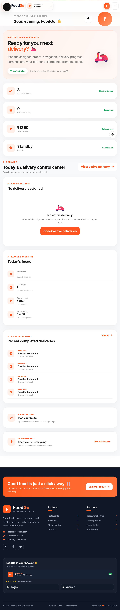

---

## 🔔 Delivery Success Notification

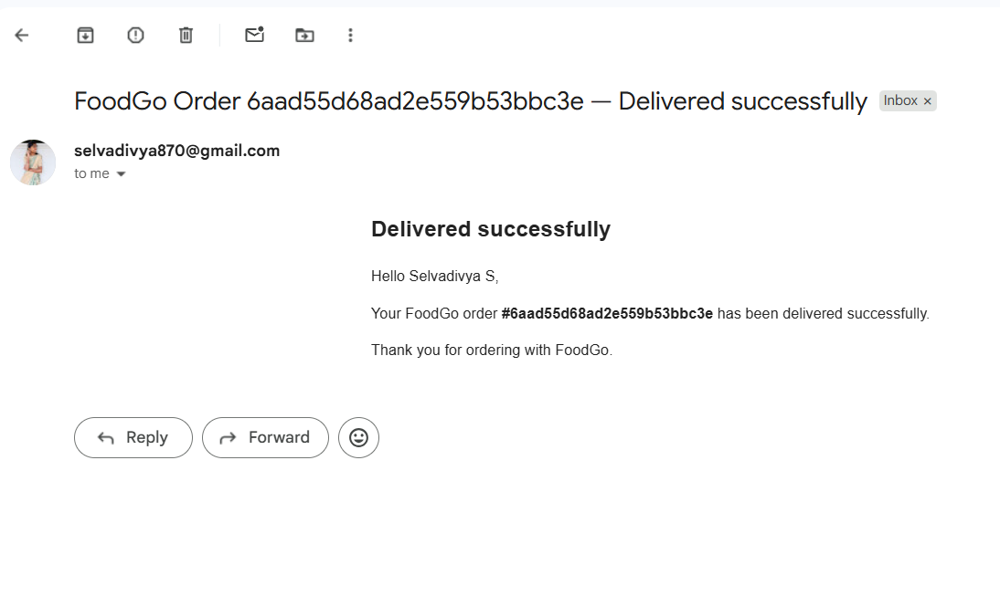

# 🎯 Learning Outcomes

This project helped me strengthen my knowledge in:

* Full-Stack Web Development
* React.js Development
* Node.js and Express.js
* MongoDB Database Management
* REST API Development
* JWT Authentication
* Role-Based Authorization
* CRUD Operations
* Socket.IO Real-Time Communication
* Location-Based Services
* Responsive Web Design
* Git & GitHub
* Vercel Deployment
* API Integration
* Debugging and Problem Solving

---

# 🚀 Future Enhancements

* Online Payment Gateway
* Food Ratings and Reviews
* Push Notifications
* Advanced Live Delivery Tracking
* Coupons and Offers
* Restaurant Analytics
* Sales Analytics Dashboard
* AI-Based Food Recommendations
* Mobile Application
* Multi-Language Support

---

# 👩‍💻 Author

**Selvadivya S**

🎓 MCA Student

💻 Full Stack Developer

🔗 GitHub:

[https://github.com/Selvadivya-S](https://github.com/Selvadivya-S)

---

## 📜 License

This project is licensed under the **MIT License**.

---


🍔 **FoodGo — Smart Food Delivery Platform**

**Discover • Order • Track • Enjoy**


